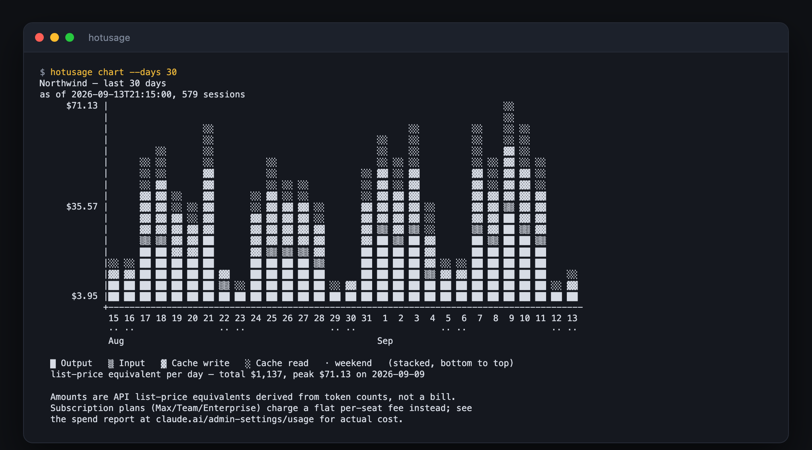

# hotusage

Know what your team's AI coding agents are actually doing — who uses them, on
which projects, with which models, and what it would cost.



<sub>Example output. The names and figures above are fabricated.</sub>

Install one command. It quietly reports this machine's Claude Code, Codex and
OpenCode usage, and it teaches your coding agent to answer questions about the
whole team's:

> **what did we spend on Claude Code last month?**
> **who used the most tokens last week?**
> **which projects are the expensive ones?**

## Install

macOS and Linux, one line:

```bash
curl -fsSL https://raw.githubusercontent.com/hotdata-dev/hotusage-client/main/install.sh | sh
```

Your browser opens, you approve the machine, and the first sync runs
immediately. Nothing to configure.

On Windows, download the `.zip` from the
[latest release](https://github.com/hotdata-dev/hotusage-client/releases),
put `hotusage.exe` somewhere on your PATH, and run `hotusage install`.

## Ask your agent

The installer adds a **skill** to Claude Code and Codex, so you can just ask in
plain language and your agent runs the right command:

> *"chart our usage for the last 30 days"*
> *"is anyone still on Opus?"*

Start a new agent session after installing so it picks the skill up.

## Or ask directly

```bash
hotusage summary                 # totals, top people and projects, recent trend
hotusage chart                   # the same, as a bar chart
hotusage users                   # per-person breakdown
hotusage projects                # per-project
hotusage providers               # Claude Code vs Codex vs OpenCode
hotusage models                  # which models, and who uses each
hotusage daily                   # day by day
hotusage sessions --user jane    # individual sessions
```

Add `--days 7`, `--days 90`, or `--days all` to any of them (30 days is the
default). `hotusage help` lists everything.

**About the dollar figures:** they are API list prices worked out from token
counts — useful for comparing people, projects and trends, but *not a bill*. If
your team is on a Max, Team or Enterprise plan you pay a flat per-seat fee and
none of this. For real spend, see the report in your Claude admin console.

## Signing in and out

Sign-in happens during install. To sign in again later — a new machine, or
switching accounts:

```bash
hotusage signin      # opens your browser; approve the code it shows
hotusage signout     # this machine stops reporting and reading
hotusage whoami      # who this machine is signed in as
```

Each machine holds its own credential, so signing one out leaves the others
alone. An admin can also revoke any machine from the dashboard.

## Staying up to date

```bash
hotusage update           # install the latest release, if there is one
hotusage update --check   # just tell me whether I'm behind
```

## What gets sent

**Your prompts and code never leave your machine.** hotusage reads the
transcript files your coding agent already writes, extracts numbers from them,
and sends only those numbers — token counts, timings, costs, model names, and
the project directory a session ran in.

Message contents, assistant replies, tool calls, code and diffs are never
transmitted, and transcript files are never uploaded.

Two fields can contain text you typed, and it is worth knowing which:

- **session title** — your agent's own summary of the session. If it recorded
  none, the fallback is the first line of your first prompt, cut at 80
  characters.
- **working directory** — the full local path, which reveals directory and user
  names.

Everything else is counts, timestamps and identifiers.

## Which tools it reads

Claude Code, Codex and OpenCode. Cursor and Gemini CLI keep no local token
counts, so there is nothing to read for them.

## Uninstalling

```bash
hotusage uninstall    # stops the background agent and removes the skill
```

That leaves the binary itself; delete it from wherever `hotusage version` says
it lives. Your already-reported usage stays in your organization's dashboard.

## Troubleshooting

| Symptom | What to do |
|---|---|
| `not signed in` | `hotusage signin` |
| "can report usage but not read it" | `hotusage signin --force` — an older sign-in, before read access existed |
| Nothing appearing in the dashboard | `hotusage sync` to run one now and see the error |
| Unsure which build you have | `hotusage version` — prints the version and its path |

Upgrading from the old `hotusage-collector`? The installer removes it and
retires its background service, so you will not end up with two running. Run
`hotusage signin --force` once afterwards to grant read access for the skill.

---

Running your own server, or working on hotusage itself?
See [`docs/internals.md`](docs/internals.md).
